# Bài tập 2 - Nhóm bài tập

##
### Team: Acceleration

### Thành viên:
```
Nguyễn Phúc Chương                19520429

Hồ Xuân Ninh                      19521978

Nguyễn Đạt Thịnh                  19520982

Nguyễn Ngọc Thiện                 19522263
```


## 1. Baby_buffer_overflow - x86 - nc 45.122.249.68 10007

### Kiểm tra file và các cơ chế bảo vệ

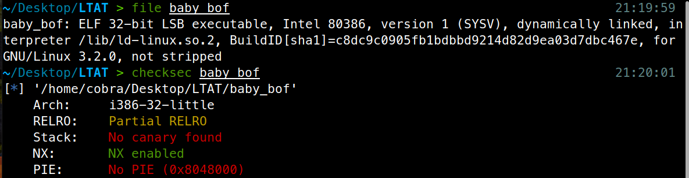

File chạy ở dạng 32 bit và liên kết động (dynamically linked). Các cơ chế bảo vệ gồm NX enabled (tức stack không có quyền excute) còn lại không canary, không PIE và partial RELEO (có thể ghi đè GOT table).

### Phân tích 

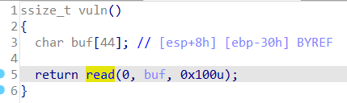

Mảng `char buf[44]` nằm ở `ebp-0x30` nhưng hàm `read` cho phép ta đọc tận 0x100 byte => buffer overflow.

Với 1 bài buffer overflow, ta có khá nhiều hướng đi.

  - Không có một hàm nào trong chương trình giúp gọi shell hay đọc flag
 
  - Không có một hàm nào sử dụng cho việc in

  - Không có gadget int0x80; ret; hoặc đại loại vậy (để call sys_write)

  - Không có chuỗi /bin/sh trong chương trình

  - Chương trình được dynamic linking

Sau khi phân tích các đặc điểm trên, ta không thể dùng các cách tấn công như ret2system, ret2libc, ROPchain, ...Vì thế bài này sử dụng 1 kĩ thuật đặc biệt là [ret2dlresolve](https://gist.github.com/ricardo2197/8c7f6f5b8950ed6771c1cd3a116f7e62).

#### Ret2dlresolve

Phân tích một chút kĩ thuật `ret2dlresolve`, khi một chương trình liên kết động, chúng dùng một hàm `_dl_runtime_resolve` (mình gọi tắt là `resolver`) để tìm địa chỉ của 1 hàm trong thư viện libc được load lên memory trong lần đầu tiên được gọi. Hàm này có đầu vào là địa chỉ của một struct có cấu trúc đặc biệt. Việc ta làm là tạo ra một struct giả để đánh lừa `resolver` và khiến nó tìm địa chỉ của hàm `system` và thực thi chúng với input đầu vào của ta.

Việc giờ cần làm là:

  - Dùng một ROPchain để gọi hàm `read(0, buf, 200)` để ghi một Payload với địa chỉ chúng ta có thể xác định được. Mình chọn `buf = 0x0804ca0c` vì nó nằm trên phân vùng data với địa chỉ cố định và có quyền write, `(buf – symtab) % 16 == 0`. Đồng thời khoảng cách là đủ để khi gọi hàm `dlresolve` không gặp lỗi ở non write memory.
  
  - Return về Payload sau khi nhập

Trong Payload, ta cần làm:

  - Tạo ra 2 fake struct gồm `symtab`, `jmprel`, và chuỗi `”system”`. Trong đó jmprel struct chứa entry GOT của hàm read và offset đến symtab struct, symtab struct chứa offset tới fake string của ta là chuỗi `“system”`
  
  - Gọi hàm `dlresolve` với input là offset của `fake jmprel struct` ta vừa tạo và truyền tham số `“/bin/sh”`

Sau khi được gọi, hàm `dlresolve` tự động trích xuất thông tin từ jmprel struct, rồi tìm đến symtab struct lấy offset của chuỗi `“system”` và tìm kiếm địa chỉ hàm `“system”` trong libc, rồi gán nó vào GOT entry của read và thực thi `system(“/bin/sh”)`.

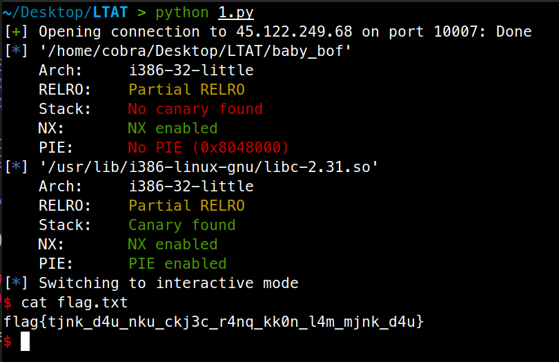

Code: [1.py](source/1.py)

Flag: `flag{tjnk_d4u_nku_ckj3c_r4nq_kk0n_l4m_mjnk_d4u}`


## 2. what_is_a_Buffer_Overflow - x64 - nc 45.122.249.68 10008

### Kiểm tra file và các cơ chế bảo vệ

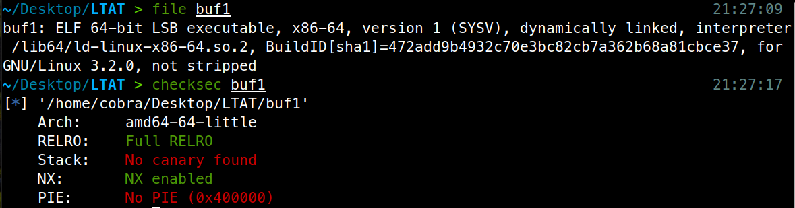

Hàm chạy trên cơ chế 64 bit, liên kết động. Các cơ chế bảo vệ gồm FULL RELRO (không ghi đè vào GOT table) và NX.

### Phân tích chương trình

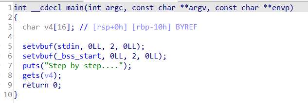

Hàm `gets(v4)` gây ra lỗi buffer overflow, và vì không có canary, ta dễ dàng ghi đè được return address của hàm `main`.

Trong chương trình ta để ý có một hàm `Puts_flag()` giúp ta in ra flag, vậy mục tiêu của chúng ta là ghi đè địa chỉ return address đến địa chỉ của hàm này. 

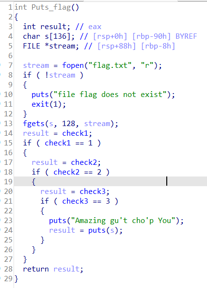

Tuy nhiên để in flag thì ta cần thỏa 3 điều kiện là `check1 == 1`, `check2 == 2`, `check3 == 3`. 

Trong chương trình có 3 hàm giúp ta gán giá trị các biến lần lượt là `Func1`, `Func2`, `Func3`. Ta chỉ cần cho chương trình chạy 3 hàm này và sau đó chạy `Puts_flag()` là thành công.

Cả 2 hàm đều có cấu trúc như sau

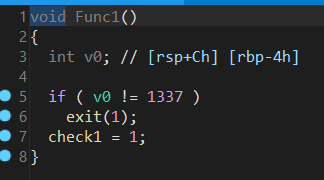

Hàm so sánh giá trị tại `rbp-0x4` với 1337, nếu thỏa thì biến check được gán, vì thế khi ta gọi hàm này, ta chỉ cần đặt `rbp-0x4 = 1337` là thành công. Ta để ý rằng khi chạy một hàm thì luôn có 2 câu lệnh là `push rbp; mov rbp, rsp;` từ đó giá trị `rbp` bị ghi đè ở hàm main sẽ không còn quan trọng nữa. Do đó ta chỉ cần khéo léo đặt giá trị tại return address - 4 = 1337 là thành công.

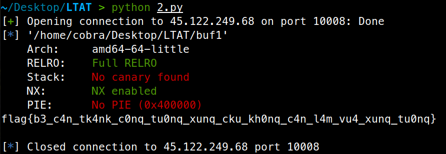

Code: [2.py](source/2.py)

Flag: `flag{b3_c4n_tk4nk_c0nq_tu0nq_xunq_cku_kh0nq_c4n_l4m_vu4_xunq_tu0nq}`


## 3. Leak - x64 - Stack cookie: nc 45.122.249.68 10004

### Kiểm tra file và các cơ chế bảo vệ

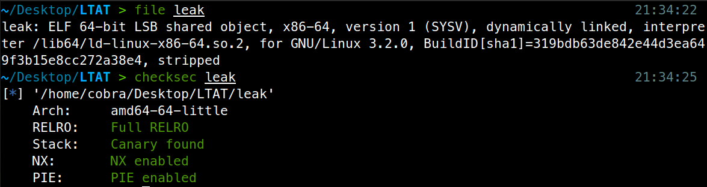

File chạy trên cấu trúc 64 bit, liên kết động và với toàn bộ cơ chế bảo vệ.

### Phân tích chương trình

Trong bài ta thấy có hàm `Shell()` gọi `system(“/bin/sh”)`, vậy mục tiêu là chạy hàm này. 

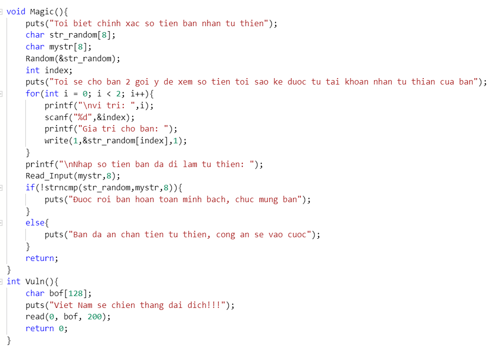

Hàm `Magic` cho ta biết giá trị 1 byte tại một vị trí `str_random[index]` với index ta nhập, index không được kiểm tra giá trị vì thế ta có thể xem được bất kì byte nào có trên stack. 

Ta dùng nó để leak địa chỉ PIE tại return address của hàm `Magic (PIE + 0xEE3)` và giá trị canary. Sau đó tính toán vị trí của hàm `Shell()` và gagdet `ret;` rồi dùng lỗi buffer overflow ở hàm `Vuln` để khai thác (vì canary ở hàm `Vuln` và hàm `Magic` cùng được load ở vị trí như nhau là `fs:0x28` vì thế chúng bằng nhau, ta có thể dùng canary leak ở hàm `Magic` để bypass ở hàm `Vuln`).

Địa chỉ của hàm `Shell()` khi chương trình chạy bằng `return address của Magic - 0xEE3 + 0xE5D`.

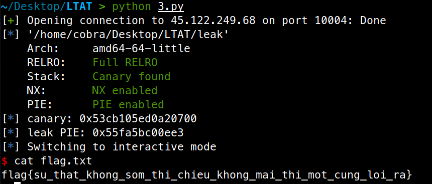

Code: [3.py](source/3.py)

Flag: `flag{su_that_khong_som_thi_chieu_khong_mai_thi_mot_cung_loi_ra}`


## 4. Rop2 - x86 - ret2text/ret2syscall: nc 45.122.249.68 10006

### Kiểm tra file và các cơ chế bảo vệ

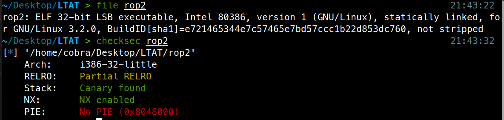

Chương trình chạy trên cơ chế 32 bit với liên kết tĩnh và 2 cơ chế bảo vệ là canary và NX.

### Phân tích

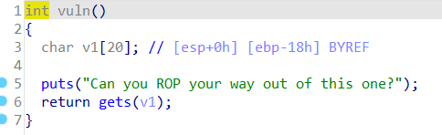

Hàm `gets` gây lỗi buffer overflow, vì chương trình liên kết tĩnh nên ta chỉ có thể gọi các hàm và các gadget có sẵn trong chương trình

=> Sử dụng các gadget để viết một payload gọi syscall `execve(“/bin/sh”, 0, 0)`, lưu ý hàm gets sẽ dùng với các gadgets hoặc địa chỉ hàm nào có chứa byte 0x0a (dấu xuống dòng)

Ta dùng tools ROPgadget để generate payload của ta, tuy nhiên để ý rằng trong ROPgadget sử dụng gadget `p += pack('<I', 0x080a8e36) # pop eax ; ret`

Gadget này chứa `0x0a` nên sẽ bị ngừng khi truyền vào hàm `gets`, ta thay bằng 2 gadget

`payload += p32(0x08049708) # pop esi ; ret`

`payload += p32(0x080581d0) # mov eax, esi ; pop ebx ; pop esi ; pop edi ; ret`

Ta `pop esi` rồi `mov eax, esi` thay cho `pop eax` là thành công


Code: [4.py](source/4.py)

Flag: `flag{73022499164268983362}`


## 5. ROPchain - x86 - ROP chains: nc 45.122.249.68 10002

### Kiểm tra file và cơ chế bảo vệ

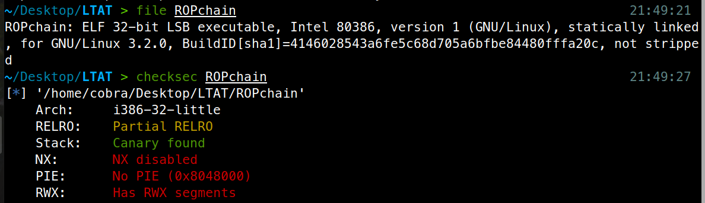

Bài này dù bật canary nhưng trong chương trình thực chất khi kiểm tra code không có canary.

### Phân tích

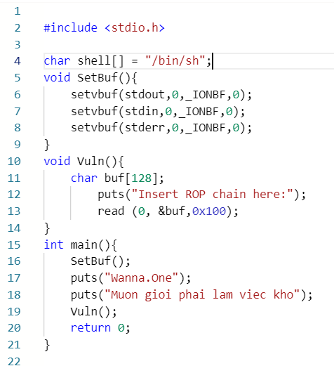

Hàm `read()` gây lỗi buffer overflow + chương trình liên kết tĩnh => sử dùng ROPgadget gọi `exceve(“/bin/sh”, 0, 0)`

Ta dùng ROPgadget tools để generate payload, thật ra bài này vì có chuỗi `/bin/sh` sẵn nên khá dễ để tự viết payload, nhưng tại mình lười nên dùng payload tự động, mà kiểm tra payload chạy vẫn ổn nên không sao cả.

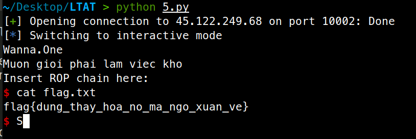

Code: [5.py](source/5.py)

Flag: `flag{dung_thay_hoa_no_ma_ngo_xuan_ve}`


## 6. Start: nc chall.pwnable.tw 10000

### Phân tích

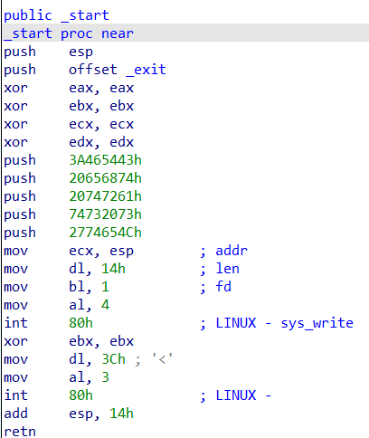

Đây là một bài viết toàn bộ bằng assembly `x86`. Ban đầu chương trình push một chuỗi lên stack và gọi syscall `write`, sau đó chương trình lại gọi syscall `read` cho phép ta đọc vào chính xác vị trí `esp` lúc nãy.

Ta có 2 hướng đi trong bài này: 

  - 1 là tận dụng các gadget để viết một ROPchain
  
  - 2 là bằng cách nào đó leak được giá trị của esp và tiến hành return to shellcode chúng ta viết trên stack.

Vì không có đủ gadget cần thiết => làm cách 2

Ta nhận thấy ở đầu chương trình gọi 2 lệnh là `push esp`, `push offset`, sau đó cuối chương trình gọi `add esp, 0x14` và `retn`. Lệnh `retn` này sẽ return về hàm `_exit`. Nhưng do trước đó hàm `read` cho phép ta overwrite vượt địa chỉ này, ta control được return address.

Vậy ta sẽ return về đâu, như hướng đi mình đã vạch ra, chúng ta cần leak địa chỉ của stack, mình sẽ return nó về dòng `mov ecx, esp`. Việc return về đây sẽ gọi `sys_write` tại vị trí esp, lúc này giá trị in ra sẽ là giá trị của `push esp`, bằng `esp hiện tại + 4`. Chúng ta sẽ để chương trình in ra địa chỉ này và – 4.

Sau khi có địa chỉ của buffer, chương trình cho phép ta nhập một chuỗi. Ta sẽ nhập shellcode vào và return về đây.

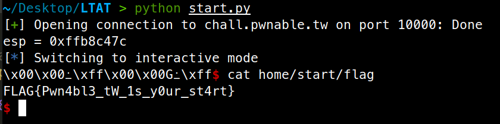

Code: [start.py](source/start.py)

Flag: `FLAG{Pwn4bl3_tW_1s_y0ur_st4rt}`


## 7. dubblesort: nc chall.pwnable.tw 10101

### Phân tích file và cơ chế bảo vệ

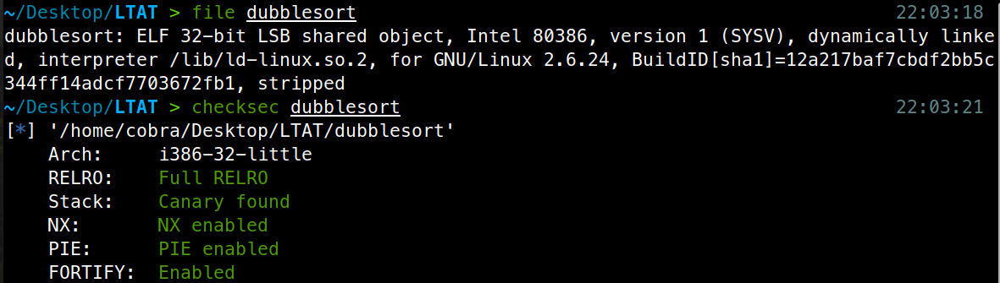

32 bit, liên kết động và toàn bộ cơ chế bảo vệ được bật.

### Phân tích

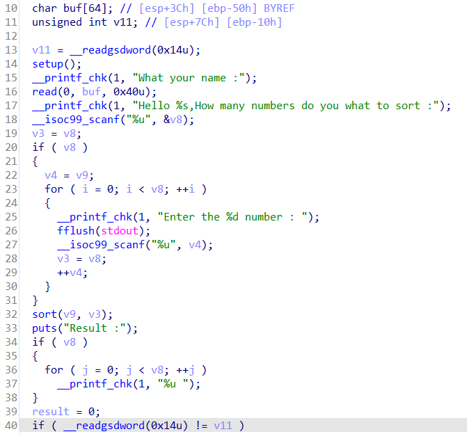

Số lượng phần tử nhập được xác định bằng biến `v8` do chúng ta nhập vào, và biến `v8` này không được kiểm tra giá trị, chúng ta có thể nhập nhiều hơn so với độ lớn 64 của mảng => Buffer Overflow 

Vì chương trình được liên kết động, mình nghĩ ngay đến cách tấn công `ret2system`, ta sẽ lợi dụng lỗ hổng overflow để ghi đè return address và gọi `system`

Để tấn công được, chúng ta cần:

  - Leak canary: Hàm `scanf(“%u”, v4)` sẽ không nhận nếu ta nhập vào một kí tự khác số, ta chỉ cần nhập `“+”` lúc hàm `scanf` gọi ở vị trí canary để bypass.

  - Vượt qua hàm `sort`: Hàm `sort` là sort theo thứ tự thấp đến cao, trong khi payload chúng ta cần là: 
      `Padding + canary + padding + system + padding + /bin/sh`

      Vì địa chỉ của `/bin/sh` luôn lớn hơn `system`, ta chỉ cần thay payload trở thành như sau: 
      `padding(0) + canary + padding(system) + system + padding(system) + /bin/sh`

      Như vậy chỉ cần giá trị `canary` được tạo ra không vượt địa chỉ của `system`, payload của ta sẽ không bị thay đổi sau hàm sort.

  - Leak được một địa chỉ của libc: Bài này ban đầu cho phép ta nhập vào một mảng `name` nằm trên stack, vì mảng `name` không được gán bằng 0 (memset), các giá trị cũ trên stack có thể hữu dụng.

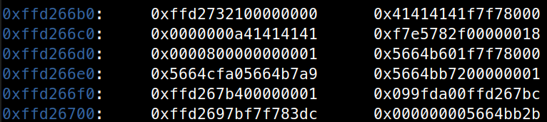

Đây là giá trị stack, chúng ta có thể leak các giá trị từ `0xffd266bc->0xffd26fc`, ở đây mình thấy được một giá trị thuộc libc là `0xf7f78000` và có offset là `0x1b0000`. Đó là phân vùng GOT của libc.

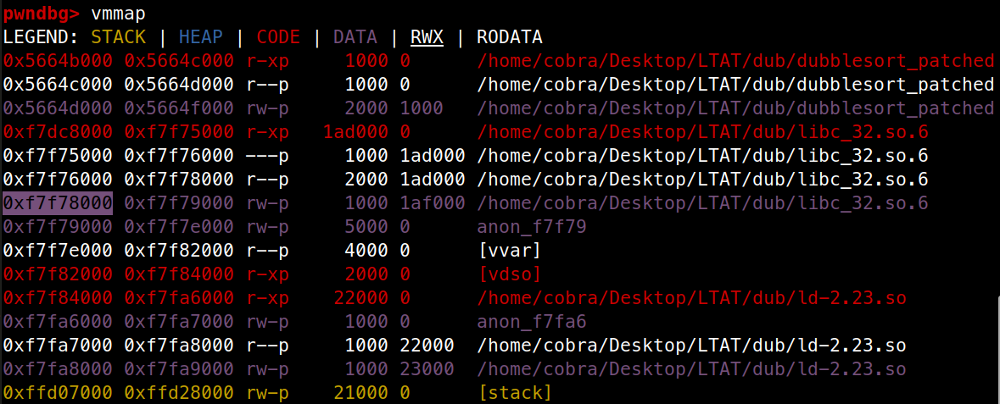

Ta có thể dùng vị trí này để leak libc, vì nó nằm ở vị trí `name+28`, ta chỉ cần nhập 28 kí tự "A" và tiến hành leak, `printf` sẽ tự động giúp chúng ta in cho đến khi gặp kí tự NULL.

Như vậy cách làm chúng ta sẽ là:

  - Leak địa chỉ libc lúc nhập biến `name`, tính toán địa chỉ `system`, `"/bin/sh"`
  
  - Sử dụng payload như sau để gọi shell (do cơ chế build chương trình sử dụng option `gcc mpreferred-stack-boundary=3` nên cách chương trình lưu các thanh ghi sẽ có khác biệt chút 🕵️‍♀️
  `padding(0) + canary + padding(system) + system + padding(system) + /bin/sh`

Thử với offset 28, ta đã có thể chạy thành công ở local.

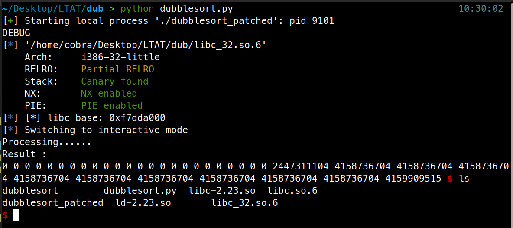

Tuy nhiên có một vấn đề khi lên server thật, đó là vị trí để leak không còn ở offset 28 nữa, mình cũng không rõ vì sao có sự khác nhau này, có lẽ nó phụ thuộc vào môi trường chạy. Sau khi exploit mình không chạy thành công với offset 28, mình đã kẹt khá lâu trước khi quyết định bruteforce (thử từ offset 0->40) và mình đã thành công ở offset 24, có lẽ tác giả cũng có ý đồ bắt phải bruteforce khi để một mảng có độ dài không quá lớn.

Payload lúc này sẽ là: `24 số 0, dấu ‘+’, 9 số địa chỉ system, 2 số địa chỉ /bin/sh`

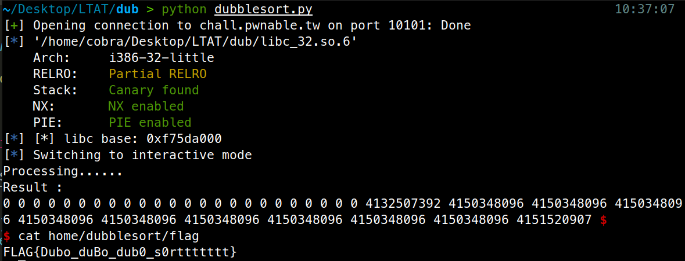

Code: [dubblesort.py](source/dubblesort.py)

Flag: `FLAG{Dubo_duBo_dub0_s0rttttttt}`


## 8. Silver Bullet: nc chall.pwnable.tw 10103

### Phân tích file và cơ chế bảo vệ

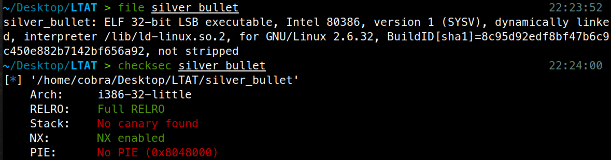

32 bit, liên kết động, FULL_RELRO, NX enable, No canary, NO PIE

### Phân tích chương trình

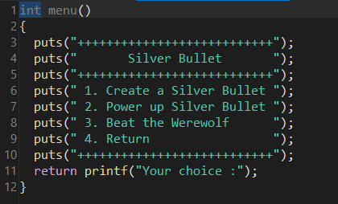

Chương trình tạo một vòng while vô tận với 4 chức năng chính.

Trong đó tính năng thứ 4 khá vô dụng

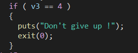

`Create_bullet`

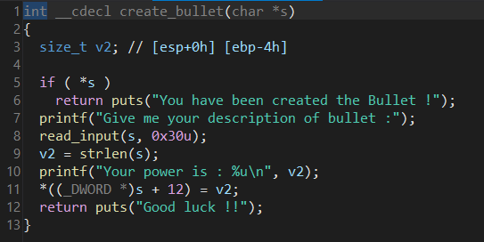

Hàm `create_bullet` tạo ra một `struct bullet` với cấu trúc bao gồm 0x30 byte đầu dùng để lưu `description` của bullet, sau đó là một số int chứa sức mạnh của viên đạn bằng với chính độ dài của chuỗi `description` ta nhập vào.

Hàm `beat`

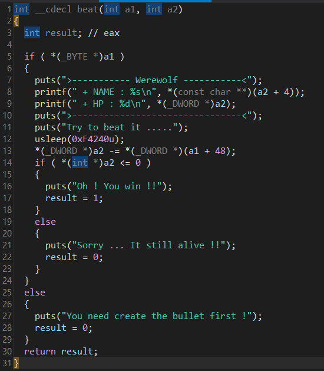

Hàm `beat` truyền vào 2 tham số a1 là struct bullet của ta và a2 là chỉ số của `werewolf`. Sau đó lấy giá trị sức mạnh của `a2` trừ cho giá trị sức mạnh của `a1`, nếu `a2 < 0`, hàm `return 1` còn lại `return 0`. Điều duy nhất chúng ta cần ở hàm này là khi trả về 1, hàm `main` sẽ return.

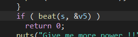

V5 là cấu trúc của `werewolf` được tạo từ đầu chương trình.


Cuối cùng là tới hàm `powerup` chứa bug 😊

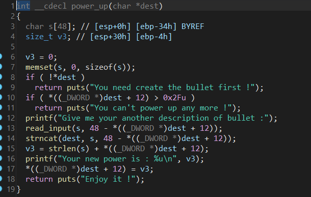

Hàm này hoạt động bằng cách đầu tiên so sánh giá trị sức mạnh của có > 0x2f  hay không. Sau đó cho phép chúng ta powerup sức mạnh của viên đạn. Sức mạnh của viên đạn ban đầu được định nghĩa bằng độ dài của chuỗi, và hàm `power_up` cho phép ta nối chuỗi mới nhập vào chuỗi `decriptions` cũ. Vị trí nối chuỗi và độ dài tối đa của chuỗi bằng `48 – độ dài chuỗi trước đó`. 

Ban đầu nhìn qua thì không hề có một lỗi gì, vì chúng ta chỉ ghi tối đa được 48 kí tự, tuy nhiên nếu các bạn biết được thì hàm `strncat` sau khi nối chuỗi xong sẽ tự động thêm NULL byte vào sau cùng nếu nó nối đủ số kí tự, vì thế ta sẽ có 1 null byte overflow, và chính byte 0 này đè lên vị trí của chỉ số sức mạnh phía sau hàm.

Từ đó ta sẽ đưa chỉ số sức mạnh về 0 và sau khi kết thúc hàm chỉ số sức mạnh được cập nhật bằng `strlen(s) + *(dest+12)`. Vậy nếu như ban đầu ta tạo một chuỗi có độ dài 0x2f, và sau đó power_up với độ dài 1, lúc này hàm `strncat` sẽ đè lên vị trí `*(dest+12)` về 0, sau đó hàm sẽ cập nhật lại `*(dest+12) = 0 + strlen(s) = 1`, và nếu ta gọi lại hàm `power_up` lần nữa, lúc này vì chỉ số sức mạng bằng 1, nhưng mảng của ta có 0x31, vì thế hàm `strncat` sẽ gây cho ta lỗi buffer overflow.

Kiểm tra các cơ chế bảo vệ không có canary và PIE, quá tuyệt vời, như vậy ta có thể tấn công `ret2system` theo cách cổ điển. Lần đầu overflow, ta sẽ gọi hàm `puts` để leak một giá trị trên bảng GOT và tính toán libc base, sau đó return về hàm `main`, lợi dụng lỗ hổng một lần nữa để gọi `system(“/bin/sh”)` với libc base leak được.

À còn một vấn đề nữa là để return ta cần chiến thắng được con wereworf. Trong lúc overflow, ta chỉ cần đè lên giá trị sức mạnh bằng một chỉ số lớn hơn `0x7fffffff` là thành công.

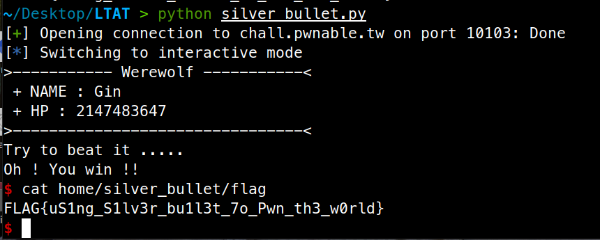

Code: [silver_bullet.py](source/silver_bullet.py)

Flag: `FLAG{uS1ng_S1lv3r_bu1l3t_7o_Pwn_th3_w0rld}`
